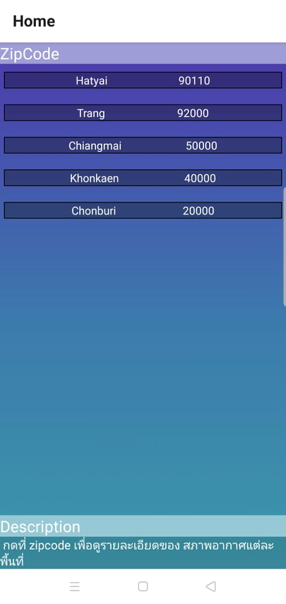
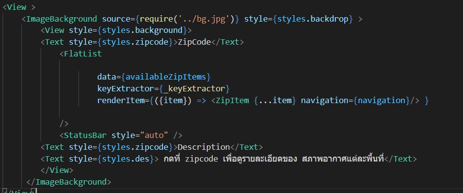
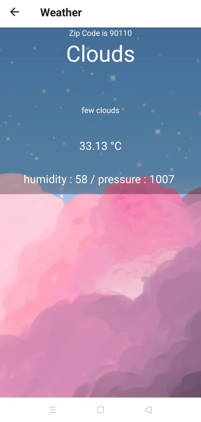
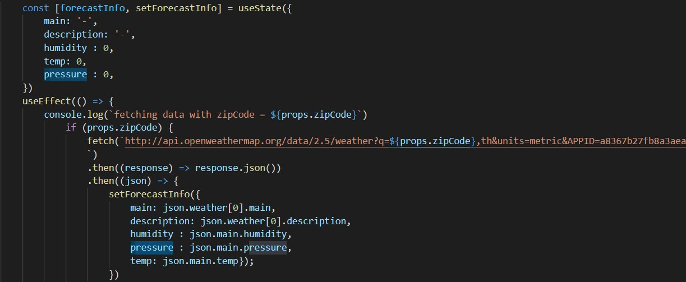

# การปรับแต่ง App
Unorder lists
* ในการปรับส่วนแรก เป็นการปรับรูปแบบของ Zipcode screen โดยเพิ่มระยะห่างของ FlatList ผ่าน style
* เพิ่ม desciption ที่หน้า Zipcode
 
 
* เพิ่มข้อมูล humidity และ ressure 
 
 
